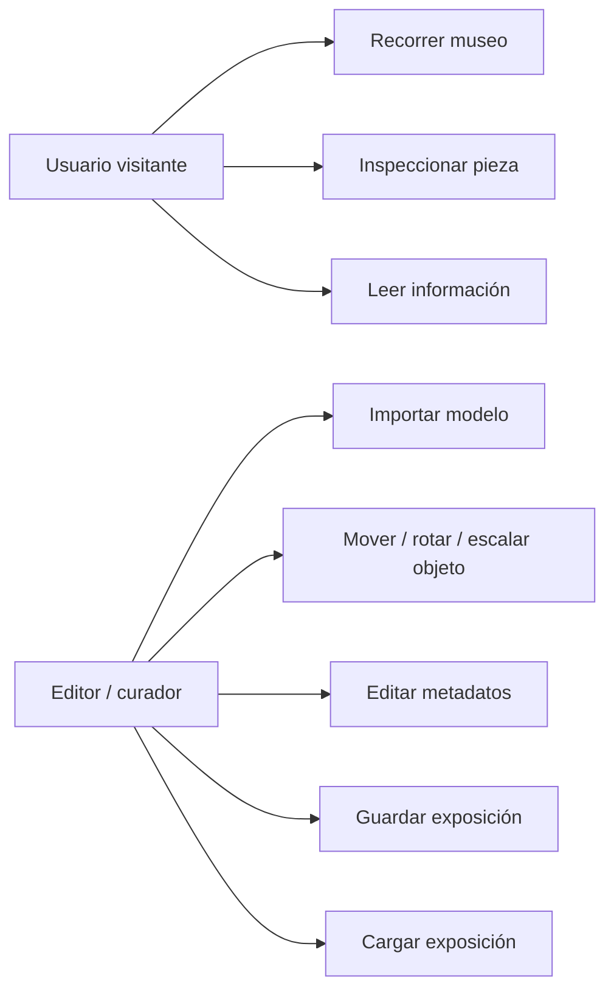
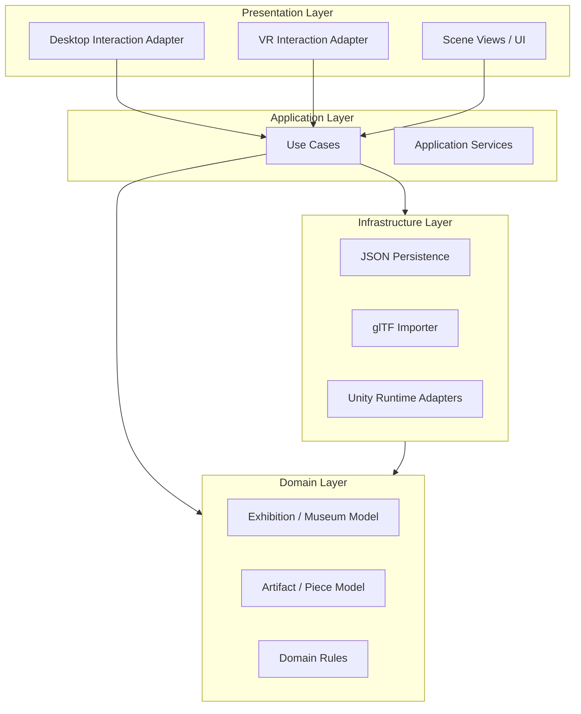
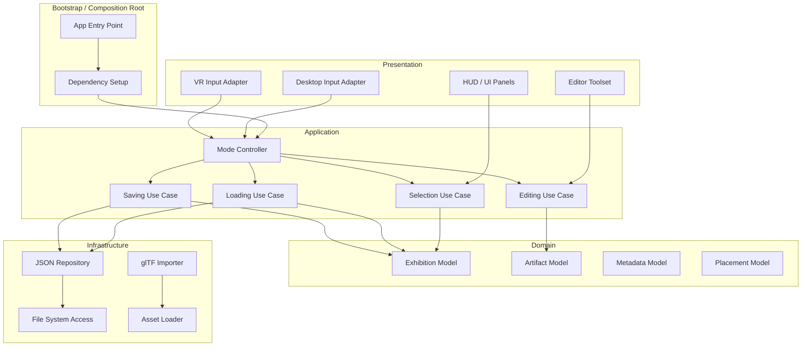
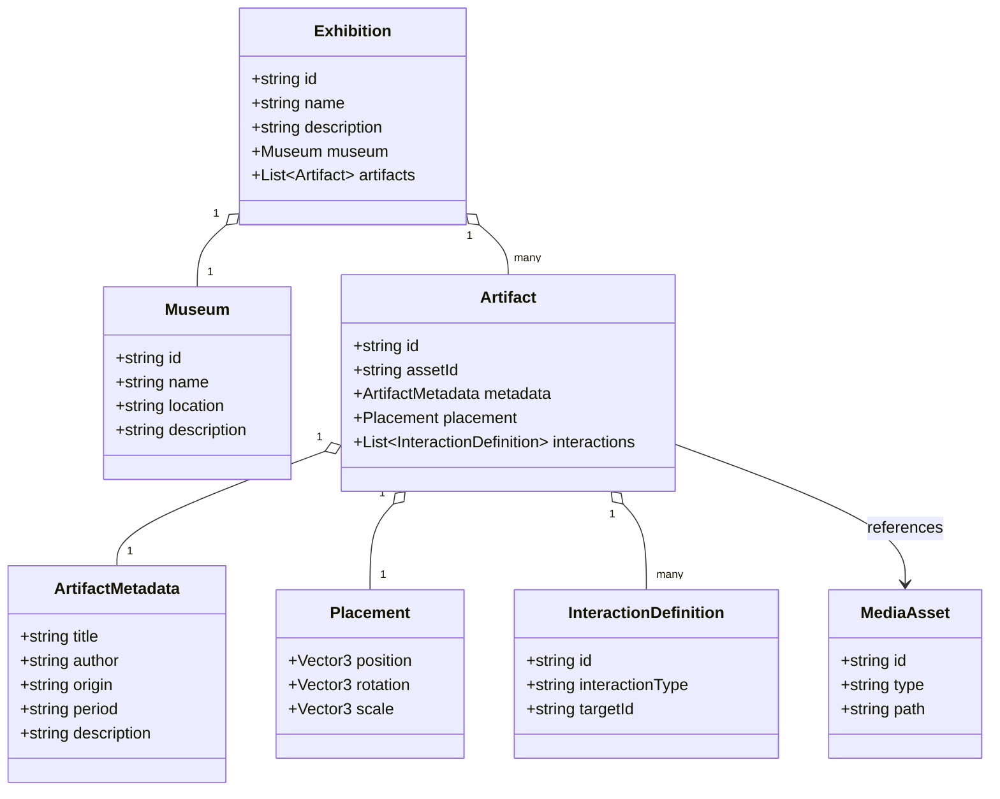

# Software Architecture Document (SAD)

## 1. Introducción

Este documento define la arquitectura de software de una plataforma modular para la creación y visualización de exposiciones virtuales tridimensionales. El proyecto tiene como caso de estudio inicial un Museo Virtual de Jachkar (Khachkar) de Armenia; sin embargo, su diseño no está limitado a ese contexto. La solución debe permitir que, en el futuro, otros museos o instituciones culturales creen y administren sus propias exposiciones sin modificar el código fuente de la aplicación.

La decisión de desarrollar el sistema desde cero en Unity responde a la necesidad de eliminar una base técnica con alta deuda acumulada, ausencia de documentación y malas prácticas de programación. En consecuencia, la arquitectura propuesta prioriza claridad estructural, modularidad, mantenibilidad y facilidad de evolución.

El sistema se concibe como una plataforma de investigación y, al mismo tiempo, como una base tecnológica reutilizable. Desde la perspectiva académica, servirá como entorno experimental para comparar la experiencia de inmersión entre una versión de escritorio y una versión de realidad virtual, manteniendo una única base de código y variando únicamente la capa de interacción.

## 2. Propósito del documento

El propósito de este Software Architecture Document es describir, justificar y delimitar la estructura arquitectónica del sistema antes de iniciar su implementación. El documento establece las decisiones principales de diseño, los principios que gobiernan la solución, los límites funcionales del producto actual y la estrategia de evolución futura.

Este SAD cumple cuatro funciones principales:

- Servir como referencia técnica para el equipo de desarrollo.
- Alinear las decisiones de implementación con los objetivos funcionales y de investigación.
- Reducir ambigüedades en torno a responsabilidades, módulos y dependencias.
- Facilitar la revisión académica, la trazabilidad de decisiones y la planificación del roadmap.

## 3. Alcance

La plataforma incluirá, en esta primera versión, dos modos de operación: Modo Espectador y Modo Editor. El primer modo permitirá recorrer el museo, inspeccionar piezas e interactuar con elementos informativos. El segundo modo permitirá importar modelos, posicionarlos dentro de la escena, editar sus metadatos y guardar la exposición resultante.

El sistema se implementará con una sola base de código en Unity 6, utilizando URP, Input System, XR Interaction Toolkit, persistencia en JSON y modelos en formato GLB / glTF. El alcance de esta versión contempla soporte prioritario para Windows, y diseño preparado para extenderse a WebGL y Realidad Virtual mediante OpenXR.

Quedan fuera del alcance de esta versión las siguientes capacidades:

- Multiplayer.
- Creación procedural.
- Inteligencia artificial.
- NPC.
- Editor colaborativo.
- Sistema de cuentas.
- Catálogo online de exposiciones.
- Descarga remota de exposiciones.
- Modelos de jugador alternativos.
- Realidad Mixta.

Estas capacidades no se implementarán en la versión actual, pero la arquitectura debe dejar puntos de extensión explícitos para permitir su incorporación futura sin reescrituras estructurales.

## 4. Objetivos

### 4.1 Objetivo general

Diseñar e implementar una plataforma modular, limpia y escalable para la creación y visualización de exposiciones virtuales tridimensionales, capaz de operar en escritorio y realidad virtual con el máximo posible de código compartido.

### 4.2 Objetivos específicos

- Permitir la creación, edición y persistencia de exposiciones virtuales mediante archivos JSON.
- Desacoplar los datos de dominio de la presentación visual y de los dispositivos de entrada.
- Centralizar la lógica funcional en módulos reutilizables y de responsabilidad única.
- Soportar una única escena principal del museo que se configure dinámicamente según la exposición cargada.
- Abstraer la interacción para que Desktop y VR utilicen la misma lógica de aplicación con adaptadores distintos.
- Diseñar una estructura preparada para escalabilidad hacia nuevas exposiciones, nuevos tipos de interacción y futuras líneas de investigación.
- Mantener compatibilidad con hardware de gama baja mediante un uso eficiente de memoria, escenas livianas y contenido cargado bajo demanda.

### 4.3 Criterios de éxito arquitectónico

La solución se considerará adecuada si cumple, como mínimo, con los siguientes criterios:

- El modo Editor y el modo Espectador comparten la mayor parte de la lógica de aplicación.
- La implementación no depende de un modelo específico de museo.
- Los datos del museo pueden cargarse, guardarse y evolucionar sin alterar el código fuente.
- La capa de interacción puede intercambiarse entre Desktop y VR mediante interfaces o adaptadores.
- La arquitectura permite extender el sistema con nuevas funcionalidades sin comprometer la estabilidad del núcleo.

## 5. Estructura del documento

El documento se estructura en las siguientes secciones:

1. Requisitos funcionales.
2. Requisitos no funcionales.
3. Stakeholders.
4. Casos de uso.
5. Arquitectura general.
6. Arquitectura por módulos.
7. Diagrama de componentes.
8. Diagrama de capas.
9. Flujo de navegación entre escenas.
10. Modelo de datos.
11. Diseño del sistema de guardado.
12. Diseño del sistema de interacción.
13. Diseño del modo Editor.
14. Diseño del modo Espectador.
15. Arquitectura VR.
16. Arquitectura Desktop.
17. Estrategia de persistencia.
18. Organización de carpetas.
19. Convenciones de nombres.
20. Estrategia Git.
21. Roadmap de desarrollo.
22. Riesgos técnicos.
23. Decisiones de diseño.
24. Extensiones futuras.

## Estado de la iteración

Esta versión consolida el Software Architecture Document en una primera redacción completa y coherente. La siguiente revisión debería enfocarse en ajustar terminología, profundizar en decisiones específicas y alinear el texto con la implementación real del proyecto cuando esta avance.

## 6. Requisitos funcionales

Los requisitos funcionales se organizan por capacidad principal del sistema.

### 6.1 Requisitos del modo Espectador

- RF-01: Permitir al usuario recorrer libremente el museo.
- RF-02: Permitir inspeccionar piezas y objetos de interés.
- RF-03: Mostrar información descriptiva de cada pieza.
- RF-04: Permitir interactuar con elementos informativos o culturales definidos por la exposición.
- RF-05: Permitir cambiar entre dispositivos de entrada sin modificar la lógica de negocio.

### 6.2 Requisitos del modo Editor

- RF-06: Permitir importar modelos 3D compatibles con GLB / glTF.
- RF-07: Permitir posicionar, rotar y escalar objetos dentro de la exposición.
- RF-08: Permitir editar metadatos asociados a cada pieza.
- RF-09: Permitir guardar la configuración completa de la exposición.
- RF-10: Permitir cargar una exposición previamente guardada.
- RF-11: Permitir alternar entre herramientas de edición y herramientas de navegación.

### 6.3 Requisitos de plataforma y soporte

- RF-12: Ejecutar en Windows como plataforma prioritaria.
- RF-13: Mantener compatibilidad de diseño con WebGL.
- RF-14: Soportar Realidad Virtual mediante OpenXR y XR Interaction Toolkit.
- RF-15: Operar bajo una única base de código compartida entre modos y plataformas.

### 6.4 Requisitos de persistencia y configuración

- RF-16: Serializar la información de museos, exposiciones y piezas mediante JSON.
- RF-17: Cargar dinámicamente la exposición activa desde datos externos.
- RF-18: Permitir extender el modelo de datos sin romper compatibilidad básica.

## 7. Requisitos no funcionales

### 7.1 Rendimiento y recursos

- RNF-01: El sistema debe mantener un consumo moderado de memoria y procesamiento.
- RNF-02: El diseño debe ser apto para computadores de gama baja dentro de los límites del contenido 3D utilizado.
- RNF-03: La carga de contenido debe realizarse de forma controlada para evitar bloqueos innecesarios.

### 7.2 Mantenibilidad y calidad

- RNF-04: El código debe seguir principios de arquitectura limpia.
- RNF-05: Cada módulo debe tener una única responsabilidad.
- RNF-06: La dependencia entre módulos debe mantenerse baja.
- RNF-07: El sistema debe ser comprensible para nuevos desarrolladores.

### 7.3 Escalabilidad y extensibilidad

- RNF-08: La arquitectura debe soportar la incorporación futura de nuevos museos.
- RNF-09: La arquitectura debe permitir agregar nuevos tipos de interacción sin reescribir el núcleo.
- RNF-10: La solución debe dejar preparada la evolución hacia multiplayer, realidad mixta y editor colaborativo.

### 7.4 Portabilidad y compatibilidad

- RNF-11: El diseño debe permitir reutilizar la misma lógica de aplicación en Desktop y VR.
- RNF-12: La solución debe ser compatible con Unity 6 y URP.

### 7.5 Trazabilidad y evolución académica

- RNF-13: Las decisiones de arquitectura deben quedar justificadas en el documento.
- RNF-14: La estructura debe permitir extender el sistema para futuros experimentos académicos.

## 8. Stakeholders

### 8.1 Investigador principal / tesista

Responsable de definir los objetivos del proyecto, validar la arquitectura y conducir la implementación y evaluación académica.

### 8.2 Profesor guía / comité académico

Evalúa la solidez conceptual, la justificación técnica y la pertinencia metodológica del sistema como proyecto de título.

### 8.3 Desarrollador / equipo técnico

Implementa los módulos, mantiene el código y evoluciona la plataforma en versiones futuras.

### 8.4 Curador o administrador de exposiciones

Configura piezas, carga contenido y administra la información expositiva sin modificar el código fuente.

### 8.5 Usuario visitante

Explora la exposición, visualiza contenido y consume la experiencia inmersiva.

### 8.6 Futuro equipo de investigación

Utiliza la plataforma como base para experimentos posteriores sobre inmersión, interacción o museografía digital.

## 9. Casos de uso

### 9.1 Vista general

La plataforma se organiza alrededor de dos flujos principales: exploración y edición. Ambos comparten el mismo dominio de exposición, pero exponen capacidades distintas según el rol activo.



### 9.2 Casos de uso principales

#### CU-01 Recorrer museo

El usuario se desplaza por la escena principal utilizando controles de Desktop o VR. El sistema debe interpretar la entrada según el dispositivo activo, sin alterar la lógica de navegación.

#### CU-02 Inspeccionar pieza

El usuario selecciona un objeto del museo para visualizar su información descriptiva, metadatos u otros contenidos asociados.

#### CU-03 Importar modelo 3D

El editor incorpora un modelo GLB / glTF a la exposición y lo registra como una pieza editable dentro del modelo de datos.

#### CU-04 Editar transformación de objeto

El editor modifica posición, rotación y escala de una pieza mediante herramientas de manipulación desacopladas de la plataforma de entrada.

#### CU-05 Editar metadatos

El editor modifica información textual o estructurada asociada a una pieza, como nombre, descripción, autor, fecha, procedencia o notas curatoriales.

#### CU-06 Guardar exposición

El sistema serializa el estado de la exposición a un conjunto de archivos JSON, preservando tanto la estructura de datos como las referencias necesarias para reconstrucción.

#### CU-07 Cargar exposición

El sistema reconstruye la exposición activa desde archivos persistidos y vuelve a instanciar la escena a partir de los datos cargados.

## 10. Arquitectura general

La arquitectura propuesta se basa en una aproximación de arquitectura limpia con separación explícita entre dominio, aplicación, presentación e infraestructura. Esta elección es consistente con el objetivo de mantener una única base de código para Desktop y VR, ya que la variación entre plataformas se concentra en la capa de interacción y presentación, mientras que las reglas de negocio permanecen estables.

### 10.1 Principios rectores

- El dominio no depende de Unity ni de dispositivos de entrada.
- La aplicación coordina casos de uso y orquesta servicios.
- La presentación adapta la interacción a Desktop o VR.
- La infraestructura implementa persistencia, importación de modelos y acceso a recursos.
- La exposición se describe como datos, no como lógica embebida en modelos 3D.

### 10.2 Decisión arquitectónica

Se adopta una estructura modular basada en capas porque permite aislar las dependencias tecnológicas de las reglas funcionales. En Unity, esto reduce el acoplamiento entre scripts de escena, prefabs, sistemas de input y persistencia. Además, facilita la evolución futura hacia multiplayer o experiencias híbridas sin romper la base de código existente.

### 10.3 Diagrama general de capas



### 10.4 Justificación

La separación entre capas permite que las interfaces de usuario cambien sin afectar el dominio del museo. Esto es especialmente importante en este proyecto porque el mismo comportamiento debe funcionar en un monitor convencional y en un casco de realidad virtual, con diferencias solo en la forma de capturar y presentar la interacción.

## 11. Arquitectura por módulos

La solución se organiza en módulos con responsabilidades delimitadas. Cada módulo debe poder evolucionar con el menor impacto posible sobre los demás.

### 11.1 Módulo de dominio

Contiene las entidades, reglas y contratos conceptuales del museo. Define qué es una exposición, qué es una pieza, cómo se representan sus metadatos y cómo se relacionan los objetos dentro del espacio expositivo.

Responsabilidad principal:

- Representar el estado del sistema sin depender de Unity ni de la interfaz.

### 11.2 Módulo de aplicación

Orquesta los casos de uso del sistema: cargar exposición, guardar exposición, seleccionar pieza, editar transformaciones, importar modelo y alternar modos.

Responsabilidad principal:

- Coordinar el dominio con los servicios de infraestructura y los adaptadores de entrada.

### 11.3 Módulo de presentación

Incluye la interfaz de usuario, los adaptadores de entrada para Desktop y VR, y la lógica visual que traduce acciones de usuario en comandos de aplicación.

Responsabilidad principal:

- Adaptar la experiencia a la plataforma sin reimplementar las reglas del sistema.

### 11.4 Módulo de infraestructura

Implementa persistencia JSON, importación de modelos, carga de recursos, serialización y acceso a archivos.

Responsabilidad principal:

- Proveer implementaciones concretas de los contratos definidos por la aplicación y el dominio.

### 11.5 Módulo de configuración y arranque

Inicializa servicios, resuelve dependencias, configura el modo activo y carga la exposición inicial.

Responsabilidad principal:

- Ensamblar el sistema sin mezclar lógica de negocio con bootstrap técnico.

## 12. Diagrama de componentes



### 12.1 Justificación del modelo de componentes

El diagrama anterior evita que los objetos de escena de Unity se conviertan en puntos centrales de control. En su lugar, cada responsabilidad se concentra en componentes especializados y los adaptadores externos solo traducen eventos de entrada o salida.

## 13. Flujo de navegación entre escenas

La arquitectura debe mantener una sola escena principal del museo. Para cumplir esta restricción, la navegación se organiza entre una escena de arranque y una escena de museo configurada dinámicamente.

### 13.1 Escenas propuestas

- BootScene: inicializa servicios, carga configuración y decide el modo activo.
- MuseumScene: contiene la escena principal del museo y se configura con la exposición seleccionada.
- OptionalLoadingOverlay: capa visual temporal para cargas largas.

### 13.2 Flujo principal

1. El juego inicia en BootScene.
2. Se cargan configuraciones, idioma, modo de input y exposición activa.
3. El sistema resuelve si debe entrar en Modo Espectador o Modo Editor.
4. Se carga MuseumScene de forma dinámica.
5. Se instancian las vistas, herramientas y objetos definidos por los datos de la exposición.
6. Se activa la capa de interacción correspondiente al modo y la plataforma.

### 13.3 Reglas de navegación

- No se crean escenas de museo por exposición.
- No se duplican escenas para Desktop y VR.
- El cambio de modo se realiza por configuración y no por recompilación.
- El contenido se inyecta desde datos externos, no desde la escena fija.

## 14. Modelo de datos

El modelo de datos debe ser explícito, serializable y estable. Los scripts de dominio deben representar información, no comportamiento de interacción.

### 14.1 Entidades principales

- Exhibition: contiene la definición general de la exposición.
- Museum: agrupa información contextual del museo o colección.
- Artifact: representa una pieza o elemento expositivo.
- ArtifactMetadata: contiene nombre, descripción, autor, fecha, origen y otros atributos curatoriales.
- Placement: define posición, rotación y escala dentro de la escena.
- MediaAsset: referencia recursos asociados como imágenes, audios o modelos.
- InteractionDefinition: describe acciones disponibles sobre una pieza o zona.

### 14.2 Relación entre entidades



### 14.3 Criterios del modelo

- Los datos deben poder serializarse a JSON sin lógica embebida.
- Las referencias deben ser estables mediante identificadores.
- Las entidades deben ser extensibles sin romper compatibilidad con archivos anteriores cuando sea posible.
- La escena Unity debe construirse a partir del modelo, no al revés.

## 15. Diseño del sistema de guardado

El sistema de guardado persiste el estado de la exposición y no el estado efímero de la ejecución.

### 15.1 Principios

- Guardar únicamente información de dominio y configuración relevante.
- Evitar serializar objetos de Unity o referencias directas a escenas.
- Usar identificadores estables para reconstruir relaciones entre piezas y recursos.
- Separar formato de persistencia de lógica de aplicación.

### 15.2 Estructura de archivos

Se recomienda una estructura basada en un archivo principal de exposición y archivos complementarios para recursos o configuraciones específicas cuando sea necesario.

- exhibition.json: definición principal de la exposición.
- museum.json: datos generales del museo.
- assets.json: catálogo de recursos referenciados.
- settings.json: parámetros de la instancia o preferencias de carga.

### 15.3 Flujo de guardado

1. El usuario solicita guardar.
2. La aplicación recopila el estado de dominio vigente.
3. El repositorio serializa los objetos a JSON.
4. El sistema escribe los archivos en disco.
5. Se informa el resultado al usuario.

### 15.4 Flujo de carga

1. El usuario selecciona una exposición.
2. El sistema lee el JSON y reconstruye el modelo de dominio.
3. Se resuelven recursos y referencias.
4. Se instancian los elementos visuales en la escena.
5. Se habilita el modo correspondiente.

## 16. Diseño del sistema de interacción

La interacción debe abstraerse para que Desktop y VR compartan la misma lógica de aplicación.

### 16.1 Contrato de abstracción

El sistema de entrada no debe hablar directamente con el museo. Debe traducir entradas físicas a comandos de alto nivel como navegar, seleccionar, manipular o cancelar.

### 16.2 Interfaces conceptuales

- IInputAdapter: transforma eventos de teclado, mouse, controlador o manos VR en acciones normalizadas.
- ISelectionService: administra la selección de piezas y objetos interactivos.
- IManipulationService: controla mover, rotar y escalar objetos.
- IModeService: habilita o deshabilita herramientas según el modo activo.

### 16.3 Flujo de interacción

1. El dispositivo emite una entrada física.
2. El adaptador convierte la entrada en una acción abstracta.
3. La acción llega al caso de uso correspondiente.
4. El caso de uso actualiza el modelo o solicita una respuesta visual.
5. La vista refleja el nuevo estado.

### 16.4 Regla de diseño

La única variación entre Desktop y VR debe estar en el adaptador de entrada y en la representación visual de ciertos controles. La lógica de selección, inspección y edición debe ser compartida.

## 17. Diseño del modo Editor

El modo Editor habilita capacidades de autoría sobre la misma escena base.

### 17.1 Responsabilidad del modo

Permitir construir y ajustar una exposición a partir de modelos, metadatos y configuraciones de ubicación.

### 17.2 Herramientas del editor

- Importación de modelos 3D.
- Selección de piezas.
- Traslación, rotación y escala.
- Edición de metadatos.
- Guardado y carga de exposiciones.

### 17.3 Principio de diseño

El editor no debe ser una escena distinta del visor. Debe ser la misma escena con herramientas adicionales activadas por el modo de operación.

### 17.4 Ventajas de esta decisión

- Reutilización máxima de código.
- Menor costo de mantenimiento.
- Misma base de evaluación para investigación comparativa.
- Reducción de inconsistencias entre la versión editable y la versión final.

## 18. Diseño del modo Espectador

El modo Espectador representa la experiencia de visita del museo.

### 18.1 Responsabilidad del modo

Permitir la exploración del espacio y la consulta del contenido sin exponer herramientas de edición.

### 18.2 Capacidades activas

- Navegación por el museo.
- Inspección de piezas.
- Lectura de descripciones.
- Activación de elementos interactivos permitidos.

### 18.3 Restricciones

El usuario no puede modificar la escena ni acceder a herramientas de autoría.

### 18.4 Relación con el editor

El modo Espectador comparte el mismo modelo de exposición, la misma escena y los mismos sistemas de selección e inspección, pero con permisos reducidos y una interfaz más simple.

## 19. Arquitectura VR

La arquitectura VR debe integrarse como una variante de presentación e interacción, no como una aplicación separada.

### 19.1 Base tecnológica

- OpenXR como capa de interoperabilidad.
- XR Interaction Toolkit para interacción con manos, rayos y objetos seleccionables.

### 19.2 Criterios de integración

- Reutilizar el dominio y la aplicación existentes.
- Mantener adaptadores de entrada específicos para VR.
- Evitar duplicar lógica de navegación o edición.
- Diseñar interfaces de usuario legibles en casco y accesibles con controladores.

### 19.3 Implicaciones arquitectónicas

La VR introduce diferencias en escala, ergonomía y representación espacial de la interfaz. Estas diferencias deben resolverse en la capa de presentación mediante prefabs, canvases espaciales y adaptadores, sin tocar las reglas del sistema.

## 20. Arquitectura Desktop

La arquitectura Desktop representa la variante base y prioritaria del sistema.

### 20.1 Base tecnológica

- Mouse y teclado mediante Input System.
- Interfaz tradicional en pantalla.
- Navegación y manipulación apoyadas en controles convencionales.

### 20.2 Criterios de diseño

- Menor carga visual que la VR.
- Acceso directo a herramientas de edición.
- Interacción precisa para tareas de autoría.

### 20.3 Relación con el núcleo común

Desktop no define reglas exclusivas; solo proporciona otra implementación del adaptador de entrada y de ciertos elementos de interfaz.

## 21. Estrategia de persistencia

La persistencia se basa en archivos JSON por su legibilidad, facilidad de depuración y bajo costo de implementación en Unity.

### 21.1 Principios de persistencia

- El formato debe ser fácil de inspeccionar por humanos.
- Los identificadores deben ser estables entre sesiones.
- La estructura debe ser extensible para nuevos campos sin invalidar versiones anteriores cuando sea posible.
- La persistencia debe almacenar datos del dominio, no objetos de escena.

### 21.2 Ubicación de archivos

Se recomienda separar archivos de contenido y archivos de ejecución.

- StreamingAssets: exposiciones base o contenido distribuido con la aplicación.
- PersistentDataPath: exposiciones guardadas por el usuario.
- Recursos externos: modelos y texturas referenciadas por ruta o identificador.

### 21.3 Estrategia de compatibilidad

La serialización debe incluir un identificador de versión para permitir migraciones futuras. Si el esquema evoluciona, el sistema podrá aplicar adaptadores de carga o valores por defecto para campos nuevos.

### 21.4 Justificación

JSON es suficiente para la versión actual porque la exposición es principalmente declarativa. El sistema no requiere una base de datos completa en esta etapa y prioriza portabilidad, simplicidad y trazabilidad.

## 22. Organización de carpetas

Se propone una organización enfocada en modularidad y claridad, alineada con la separación por capas y con las buenas prácticas de Unity para control de versiones, colaboración y mantenibilidad.

### 22.1 Estructura sugerida

```text
Assets/
	Art/
	Audio/
	Materials/
	Prefabs/
	Scenes/
		BootScene.unity
		MuseumScene.unity
	Scripts/
		Domain/
		Application/
		Infrastructure/
		Presentation/
			Desktop/
			VR/
			CompositionRoot/
	ScriptTemplates/
	UI/
	Resources/
	StreamingAssets/
		Exhibitions/
		Config/
	Tests/
	Sandbox/
	ThirdParty/
```

### 22.2 Criterios de organización

- Separar contenido artístico de código.
- Agrupar scripts por capa arquitectónica y mantener esa misma división en los namespaces.
- Evitar espacios en nombres de archivos y carpetas para no complicar herramientas de línea de comandos, automatización o pipelines de Unity.
- Mantener recursos persistentes fuera de la lógica de negocio.
- Reservar una carpeta explícita para pruebas y otra para dependencias de terceros.
- Crear una carpeta de sandbox para escenas o prototipos que no formen parte del flujo productivo.
- Evitar carpetas vacías en control de versiones; si una carpeta debe existir vacía, incluir un archivo marcador como `.keep` o crearla solo cuando vaya a contener activos reales.

### 22.3 Regla operativa

El contenido propio del proyecto debe vivir directamente bajo `Assets`, mientras que los paquetes externos y activos de terceros deben mantenerse en `Assets/ThirdParty` o en la estructura que traigan sus propios paquetes, sin mezclarse con el contenido del museo.

### 22.4 Beneficio esperado

La estructura reduce la fricción al incorporar nuevos desarrolladores y facilita localizar responsabilidades sin recorrer toda la escena de Unity.

## 23. Convenciones de nombres

Las convenciones deben ser consistentes, predecibles y compatibles con estándares habituales de C# y Unity.

### 23.1 Código C#

- Clases y enums: PascalCase.
- Interfaces: PascalCase con prefijo I.
- Métodos: PascalCase.
- Variables privadas: camelCase.
- Campos serializados privados: camelCase.
- Constantes: UPPER_SNAKE_CASE cuando represente valores globales o configuraciones.

### 23.2 Unity

- Escenas: PascalCase, por ejemplo BootScene y MuseumScene.
- Prefabs: PascalCase y sufijo descriptivo cuando corresponda, por ejemplo ArtifactPanel.
- ScriptableObjects: nombre descriptivo del contenido o configuración.

### 23.3 Datos y archivos

- Archivos JSON: nombres funcionales consistentes, por ejemplo exhibition.json.
- IDs de dominio: cadenas estables, legibles y únicas dentro del contexto del museo.

### 23.4 Plantillas de script

- Las plantillas específicas del proyecto deben ubicarse en `Assets/ScriptTemplates`.
- Las plantillas deben incluir un encabezado uniforme para documentar propósito, autor y fecha cuando el equipo lo considere necesario.
- Los nuevos scripts de Unity deben heredar de la plantilla del proyecto siempre que exista una versión equivalente.

### 23.5 Regla general

El nombre debe reflejar la responsabilidad del elemento y no su implementación interna.

## 24. Estrategia Git

La estrategia Git debe favorecer trazabilidad, revisión y estabilidad académica.

### 24.1 Modelo de trabajo

Se recomienda un flujo basado en ramas cortas y revisiones por cambios:

- main: versión estable.
- develop: integración de trabajo cuando sea necesario.
- feature/*: funcionalidades o refactorizaciones específicas.
- fix/*: correcciones puntuales.

### 24.2 Reglas de trabajo

- Cada rama debe resolver un objetivo concreto.
- Los commits deben ser pequeños y descriptivos.
- Las revisiones deben validar impacto arquitectónico antes de fusionar.
- Los artefactos generados por Unity no deben contaminar innecesariamente el historial.

### 24.3 Convención de commits

Se sugiere una convención semántica simple, por ejemplo:

- feat: nueva funcionalidad.
- fix: corrección de error.
- refactor: cambio estructural sin alterar comportamiento.
- docs: documentación.
- test: pruebas.

### 24.4 Justificación

Un flujo simple de ramas y commits facilita el seguimiento del proyecto de título y la identificación de decisiones técnicas relevantes.

## 25. Roadmap de desarrollo

El roadmap se organiza en fases incrementales para reducir riesgo y validar arquitectura tempranamente.

### 25.1 Fase 1: base técnica

- Crear la estructura del proyecto en Unity.
- Configurar URP, Input System y paquetes base.
- Implementar la escena de arranque y la escena principal.
- Definir contratos del dominio y la aplicación.

### 25.2 Fase 2: núcleo funcional

- Implementar carga de exposición desde JSON.
- Construir el modelo de datos del museo.
- Instanciar piezas en la escena a partir de datos.
- Habilitar selección e inspección.

### 25.3 Fase 3: modo Editor

- Importación de modelos 3D.
- Transformación de objetos.
- Edición de metadatos.
- Guardado y carga de exposiciones.

### 25.4 Fase 4: modo Espectador

- Navegación del museo.
- Interfaz de lectura e interacción.
- Ajuste de permisos y experiencia de visita.

### 25.5 Fase 5: soporte de plataformas

- Adaptación para Desktop.
- Adaptación para VR.
- Validación de compatibilidad con WebGL cuando corresponda.

### 25.6 Fase 6: optimización y validación académica

- Optimización de rendimiento.
- Pruebas de usabilidad.
- Medición comparativa entre Desktop y VR.
- Consolidación de documentación final.

## 26. Riesgos técnicos

### 26.1 Riesgo: exceso de acoplamiento en Unity

Unity puede incentivar soluciones centradas en escenas y prefabs que mezclan lógica y presentación. Esto podría deteriorar la mantenibilidad.

Mitigación: imponer capas explícitas, contratos entre módulos y una composición centralizada.

### 26.2 Riesgo: complejidad de importación de modelos

La compatibilidad con glTF puede introducir problemas de escala, materiales y jerarquías.

Mitigación: definir un pipeline de importación controlado y validar formatos soportados.

### 26.3 Riesgo: divergencia entre Desktop y VR

Si cada plataforma evoluciona por separado, la base compartida se fragmentará.

Mitigación: compartir casos de uso y aislar la diferencia solo en adaptadores de interacción.

### 26.4 Riesgo: rendimiento insuficiente en equipos modestos

Un museo 3D puede consumir demasiados recursos si el contenido no se controla.

Mitigación: limitar carga simultánea, optimizar assets y mantener una escena liviana.

### 26.5 Riesgo: expansión de alcance

La presencia de futuras extensiones puede empujar al proyecto hacia funcionalidades no planificadas.

Mitigación: registrar claramente el alcance de esta versión y diferenciar extensiones futuras de requisitos actuales.

## 27. Decisiones de diseño

### 27.1 Una sola escena principal del museo

Se adopta para evitar duplicación de lógica, simplificar el mantenimiento y permitir que una exposición se configure dinámicamente.

### 27.2 Una sola base de código para Desktop y VR

Se adopta para sostener el objetivo de investigación comparativa y maximizar reutilización.

### 27.3 Persistencia en JSON

Se adopta por simplicidad, legibilidad y bajo costo de integración con Unity.

### 27.4 Arquitectura limpia y modular

Se adopta para reducir acoplamiento, facilitar pruebas y preparar el sistema para futuras extensiones.

### 27.5 Interacción mediante interfaces

Se adopta para abstraer dispositivos de entrada y permitir variantes de interacción sin tocar el dominio.

### 27.6 No usar lógica en modelos 3D

Se adopta para evitar que el contenido visual dependa de comportamientos específicos y para mantener el museo como datos configurables.

## 28. Extensiones futuras

La arquitectura debe dejar puntos claros para futuras capacidades sin comprometer la versión actual.

### 28.1 Multiplayer

Podría agregarse una capa de sincronización de estado y sesiones compartidas.

### 28.2 Avatares personalizables

Requerirían un módulo de identidad visual y configuración del usuario.

### 28.3 Sistema de cuentas

Podría introducir autenticación, perfiles y permisos diferenciados.

### 28.4 Diferentes modelos de jugador

La interfaz de locomoción e interacción podría variar por perfil de usuario.

### 28.5 Catálogo online y descarga de exposiciones

Exigiría servicios de red, versionado de contenido y gestión remota de paquetes.

### 28.6 Realidad Mixta

Podría incorporarse como otra variante de presentación que reutilice dominio y aplicación.

### 28.7 Editor colaborativo

Requeriría sincronización en tiempo real, control de concurrencia y manejo de conflictos.

### 28.8 Línea de investigación futura

La plataforma también puede servir para estudios sobre presencia, navegación espacial, accesibilidad y comparación de interfaces inmersivas.

